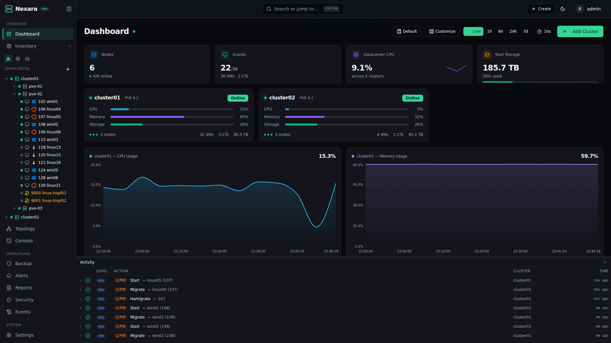
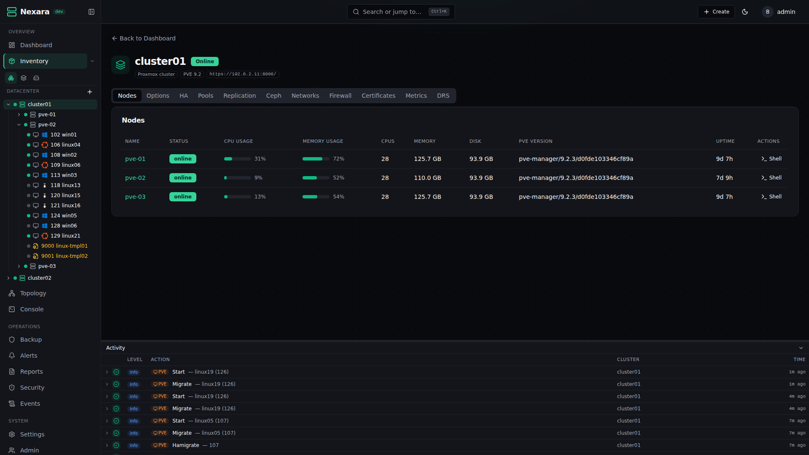
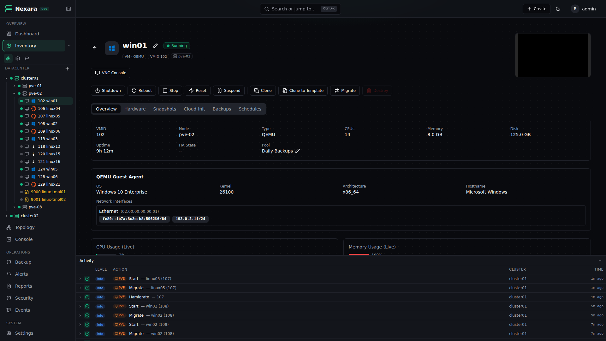
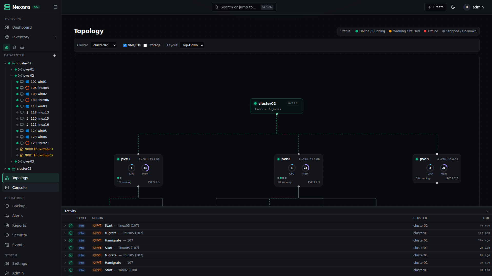
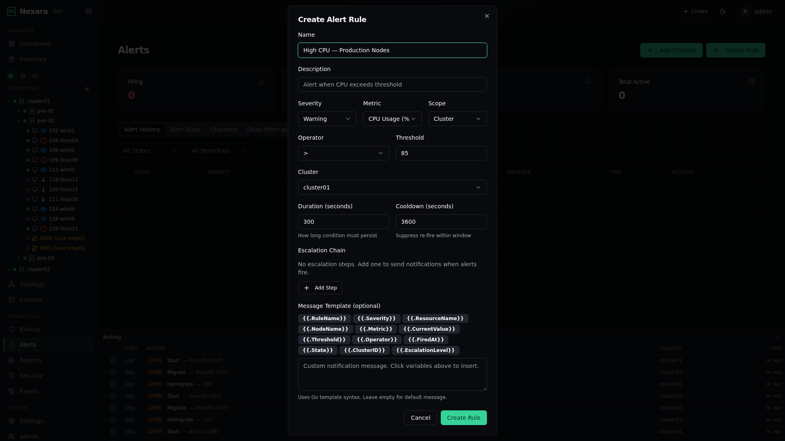
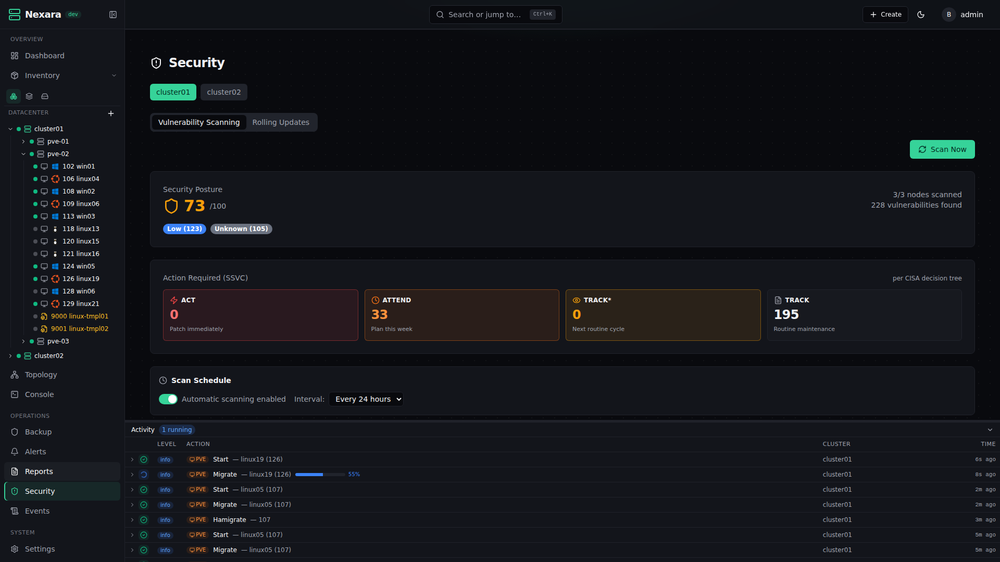
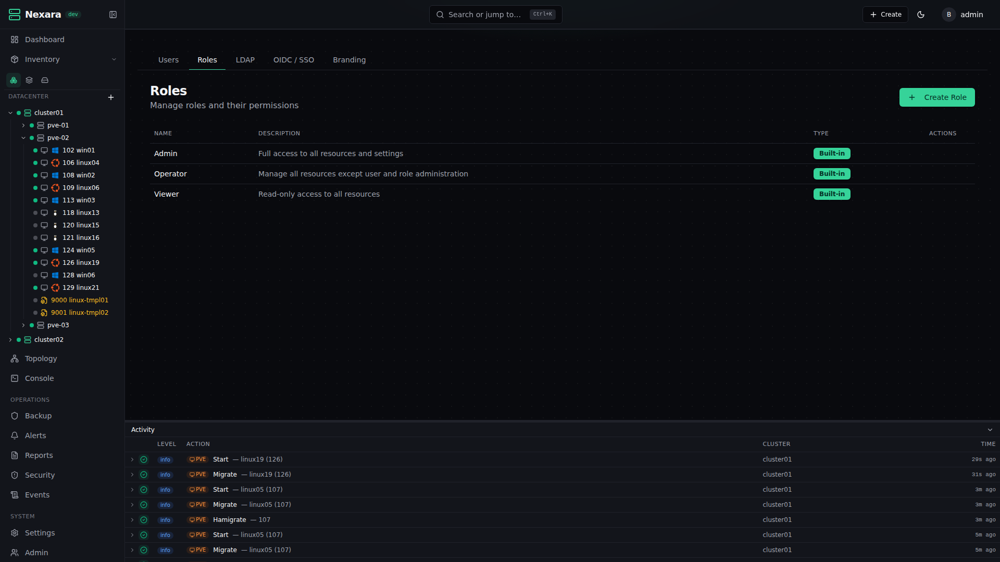

<p align="center">
  <h1 align="center">Nexara</h1>
  <p align="center">
    <strong>Centralized management for Proxmox VE & PBS — like vCenter, but open-source.</strong>
  </p>
  <p align="center">
    <a href="LICENSE"></a>
    <a href="https://go.dev"></a>
    <a href="https://www.typescriptlang.org"></a>
    <a href="docker-compose.yml"></a>
    <a href="https://github.com/bigjakk/Nexara/releases"></a>
  </p>
</p>

Manage multiple Proxmox clusters from a single pane of glass. Real-time dashboards, granular RBAC, automated operations, enterprise security — all in a single Docker container.

<!-- Add your screenshots to docs/screenshots/ and uncomment the lines below.

<p align="center">
  
</p>

<details>
<summary><strong>More screenshots</strong></summary>
<br>
<table>
  <tr>
    <td></td>
    <td></td>
  </tr>
  <tr>
    <td></td>
    <td></td>
  </tr>
  <tr>
    <td></td>
    <td></td>
  </tr>
</table>
</details>

-->

---

## Quick Start

> **Requirements:** Docker and Docker Compose

### One-command install

```bash
curl -fsSL https://raw.githubusercontent.com/bigjakk/Nexara/master/scripts/install.sh | bash
```

### Manual setup

```bash
git clone https://github.com/bigjakk/Nexara.git && cd Nexara
cp .env.example .env        # edit POSTGRES_PASSWORD at minimum
docker compose up -d
```

Open **http://localhost** and create your admin account. That's it.

### What you'll need from Proxmox

To connect a cluster, you need a **Proxmox API token**. In your Proxmox web UI:

1. **Datacenter** → **Permissions** → **API Tokens** → **Add**
2. Create a token for an admin user (e.g. `root@pam`) — uncheck "Privilege Separation" for full access
3. Copy the **Token ID** (e.g. `root@pam!nexara`) and **Secret**

Then in Nexara: **Add Cluster** → paste the API URL (`https://your-proxmox:8006`) and token.

---

## Features

<table>
<tr>
<td width="50%">

### Infrastructure
- Multi-cluster management (unlimited clusters)
- Real-time CPU, memory, disk, network metrics
- VM/CT lifecycle — create, migrate, snapshot, clone, destroy
- Disk management — resize, move, attach/detach
- Template management and resource pools
- Live migration with pre-flight checks

</td>
<td width="50%">

### Consoles
- **VNC** — browser-based graphical console (noVNC)
- **Serial** — xterm.js terminal for headless systems
- **Node shell** — direct Proxmox node access

### Storage & Backup
- PBS integration with datastore monitoring
- Scheduled backups with retention policies
- Restore to any cluster/node
- Ceph monitoring (OSD, pools, CephFS)

</td>
</tr>
<tr>
<td>

### Automation
- **DRS** — automatic workload balancing with affinity rules
- **Rolling updates** — drain/upgrade/reboot/restore pipeline
- **Alert engine** — threshold alerts, escalation chains, 7 notification channels (SMTP, Slack, Discord, Teams, Telegram, Webhook, PagerDuty)
- **CVE scanning** — automated vulnerability scanning
- **Scheduled tasks** — cron-based snapshots, backups, reboots

</td>
<td>

### Security & Enterprise
- **RBAC** — granular roles and permissions
- **LDAP/AD** — JIT provisioning, group-to-role mapping
- **OIDC/SSO** — Google, Okta, Keycloak, etc.
- **2FA** — TOTP with recovery codes
- **Audit logging** — full trail with syslog forwarding
- **Firewall** — cluster and VM-level rules, templates, SDN
- **Reports** — scheduled HTML/CSV for compliance

</td>
</tr>
<tr>
<td>

### Networking
- Firewall management with reusable templates
- SDN — zones, VNets, subnets, controllers
- Network interfaces — bridges, bonds, apply/revert
- ACME certificate management

</td>
<td>

### User Experience
- **Topology map** — interactive React Flow infrastructure view
- **Global search** — find anything instantly
- **Theming** — dark/light mode, 9 accent colors
- **Custom branding** — logo, favicon, app title
- **Localization** — i18n framework with language selector

</td>
</tr>
</table>

---

## Architecture

Nexara runs as a **single Go binary** serving the API, WebSocket, embedded React SPA, metric collector, and task scheduler — all in one process.

```
                         ┌──────────────────────────────────────┐
   Browser ──────────▶   │        Nexara  (port 8080)           │
   (React SPA)           │                                      │
                         │   REST API    /api/v1/*              │
                         │   WebSocket   /ws/*                  │   ┌─────────────────┐
                         │   Frontend    /*  (embedded SPA)     │──▶│  PostgreSQL 16   │
                         │                                      │   │  + TimescaleDB   │
   Proxmox VE  ◀────▶   │   Collector   (goroutine)            │   └─────────────────┘
   clusters              │   Scheduler   (goroutine)            │
                         │                                      │──▶  Redis 7
                         └──────────────────────────────────────┘
```

| Container | Image | Port | Purpose |
|-----------|-------|------|---------|
| `nexara` | `ghcr.io/bigjakk/nexara` | 80 → 8080 | API + WS + SPA + collector + scheduler |
| `nexara-db` | `timescale/timescaledb:latest-pg16` | 5432 (localhost only) | Database with time-series |
| `nexara-redis` | `redis:7-alpine` | 6379 (internal) | Pub/sub, cache, sessions |

---

## Configuration

All settings are environment variables in `.env`. Secrets are auto-generated on first start and persisted to the data volume.

| Variable | Default | Description |
|----------|---------|-------------|
| `POSTGRES_PASSWORD` | `changeme` | Database password (**change this**) |
| `JWT_SECRET` | auto-generated | JWT signing key |
| `ENCRYPTION_KEY` | auto-generated | AES-256-GCM key for secrets at rest |
| `API_PORT` | `8080` | Server listen port |
| `METRICS_COLLECT_INTERVAL` | `10s` | How often to poll Proxmox for metrics |
| `LOG_LEVEL` | `info` | `debug` / `info` / `warn` / `error` |
| `PUID` / `PGID` | `1000` | Container user/group ID |
| `DATA_DIR` | Docker volume | Custom data path (e.g. NFS mount) |

See [`.env.example`](.env.example) for the full reference.

---

## Reverse Proxy

Nexara serves everything on a single port, so proxy config is simple:

<details>
<summary><strong>Nginx</strong></summary>

```nginx
server {
    listen 443 ssl;
    server_name nexara.example.com;

    client_max_body_size 15G;  # for ISO uploads

    location / {
        proxy_pass http://127.0.0.1:80;
        proxy_set_header Host $host;
        proxy_set_header X-Real-IP $remote_addr;
        proxy_set_header X-Forwarded-For $proxy_add_x_forwarded_for;
        proxy_set_header X-Forwarded-Proto $scheme;

        # WebSocket support
        proxy_set_header Upgrade $http_upgrade;
        proxy_set_header Connection "upgrade";
        proxy_read_timeout 86400s;
    }
}
```
</details>

<details>
<summary><strong>Traefik</strong></summary>

```yaml
# docker-compose.override.yml
services:
  nexara:
    labels:
      - "traefik.enable=true"
      - "traefik.http.routers.nexara.rule=Host(`nexara.example.com`)"
      - "traefik.http.routers.nexara.tls.certresolver=letsencrypt"
      - "traefik.http.services.nexara.loadbalancer.server.port=8080"
```
</details>

<details>
<summary><strong>Caddy</strong></summary>

```
nexara.example.com {
    reverse_proxy nexara:8080
}
```
</details>

> **Tips:** Set proxy max body size to at least 15 GB for ISO uploads. Ensure WebSocket `Upgrade` headers are forwarded. Use long read timeouts for persistent WebSocket connections.

---

## Tech Stack

| Layer | Technology |
|-------|-----------|
| Backend | Go 1.24, Fiber v3, sqlc + pgx, gorilla/websocket |
| Frontend | React 19, TypeScript 5, Vite 6, Shadcn/ui, TanStack Query/Table, Zustand, Recharts, xterm.js, noVNC, React Flow |
| Database | PostgreSQL 16 + TimescaleDB |
| Cache | Redis 7 (Valkey compatible) |
| Deploy | Docker Compose (3 containers) |

---

## Documentation

| | |
|--|--|
| [Installation Guide](docs/installation.md) | Setup, configuration, backup, troubleshooting |
| [Admin Guide](docs/admin-guide.md) | Cluster, user, RBAC, auth, alert management |
| [API Reference](docs/api-reference.md) | REST API endpoints with examples |
| [Contributing](docs/contributing.md) | Development setup, conventions, PR process |
| [Security Policy](SECURITY.md) | Vulnerability reporting |

---

## Contributing

Contributions welcome! See [docs/contributing.md](docs/contributing.md) for guidelines.

```bash
make build          # Build Go binary
make test           # Run tests
make lint           # Run linters
make generate       # Regenerate sqlc + oapi-codegen
make docker-up      # Start full stack locally
```

---

## CI/CD

Every push runs Go lint/test/build, frontend typecheck/lint/test/build, and Docker build validation. Pushing a `v*` tag builds and publishes to `ghcr.io/bigjakk/nexara` with auto-generated release notes.

```bash
git tag -a v1.0.0 -m "Release v1.0.0"
git push origin v1.0.0
```

---

## License

[GNU Affero General Public License v3.0](LICENSE)
