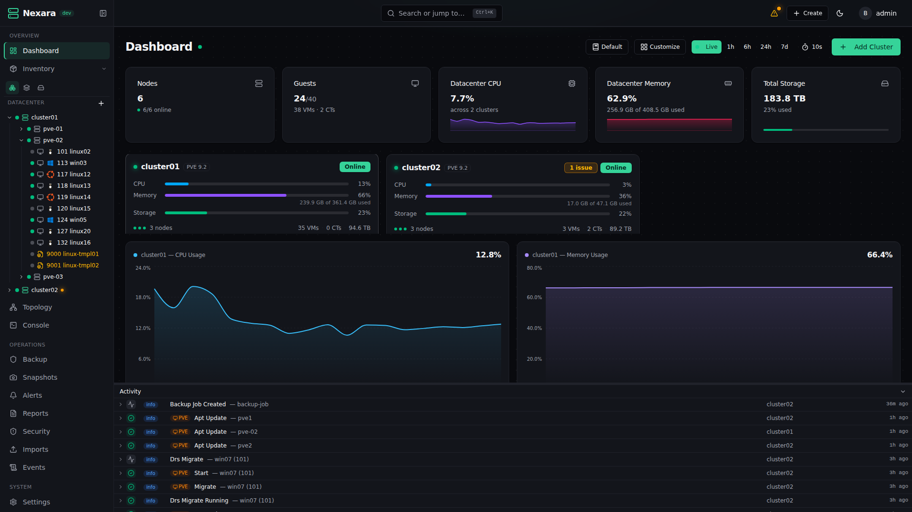
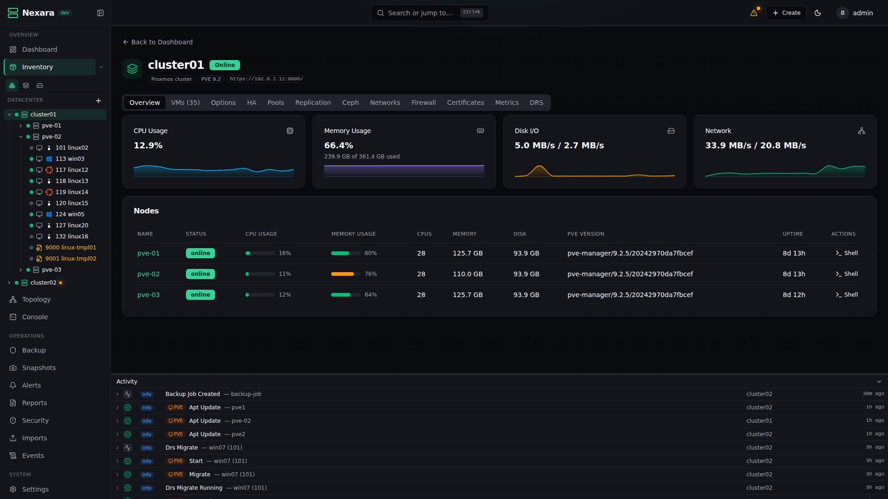
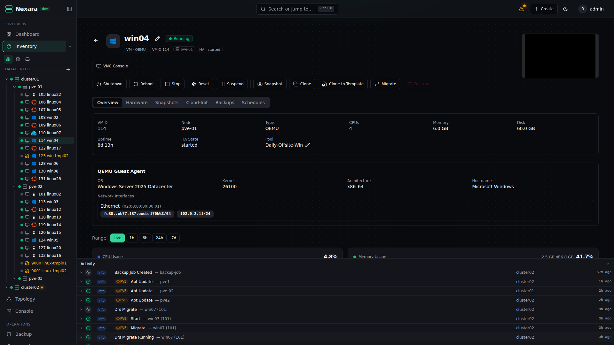
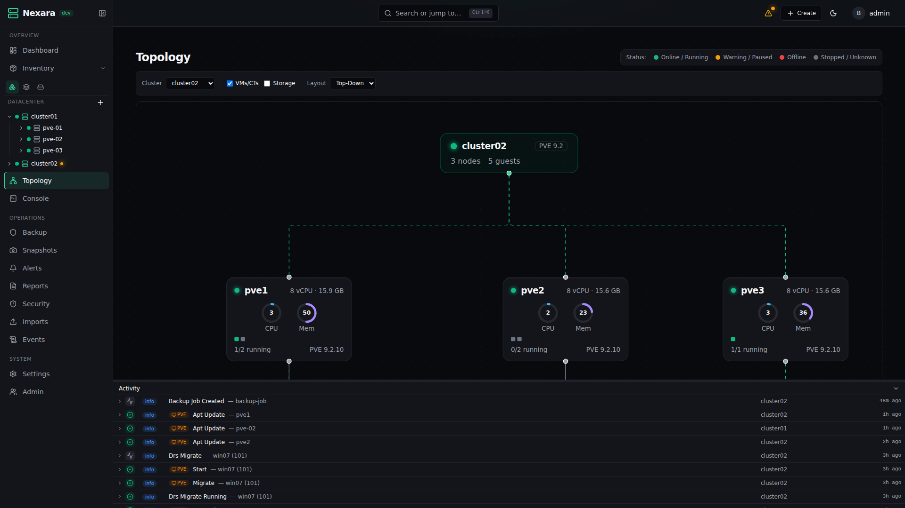
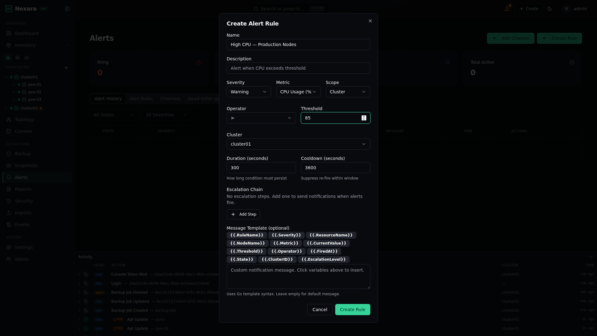
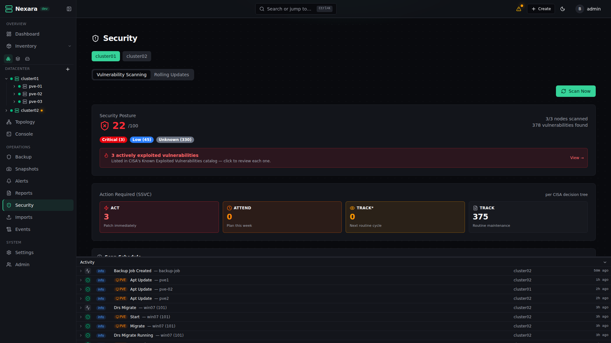
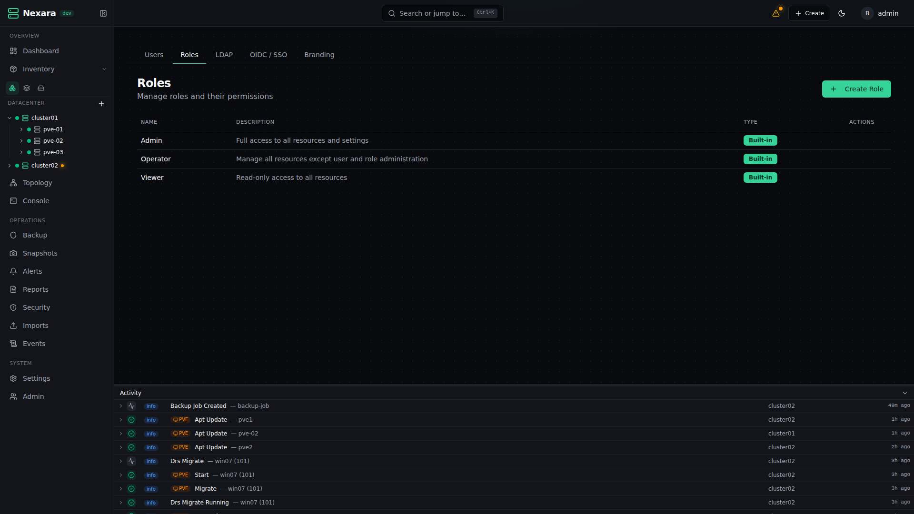
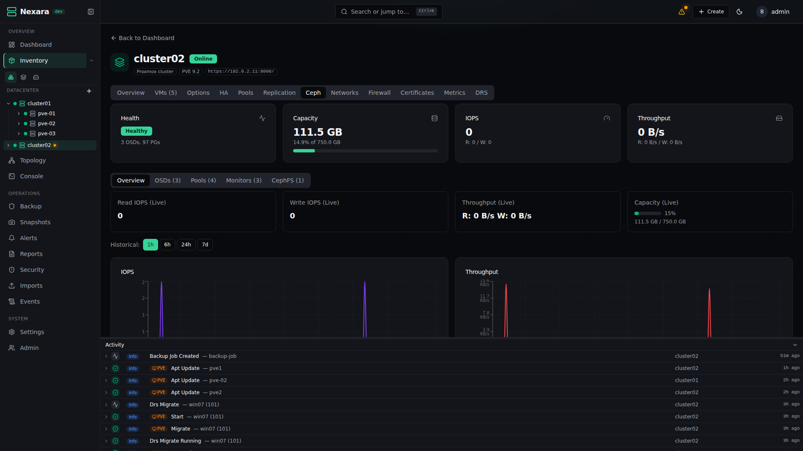
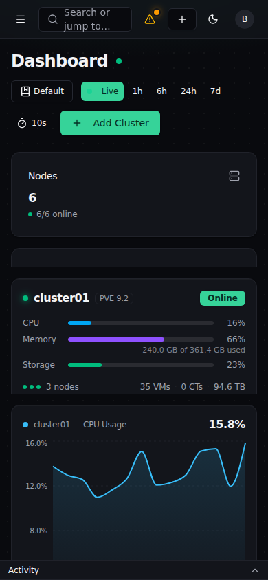
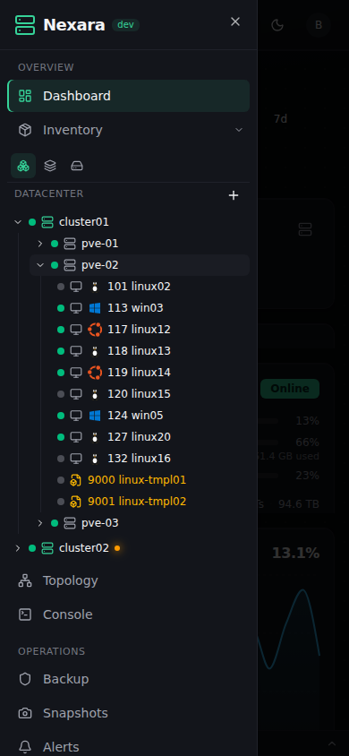

<p align="center">
  <h1 align="center">Nexara</h1>
  <p align="center">
    <strong>Centralized management for Proxmox VE & PBS — like vCenter, but open-source.</strong>
  </p>
  <p align="center">
    <a href="https://github.com/bigjakk/Nexara/stargazers"></a>
    <a href="https://github.com/bigjakk/Nexara/releases"></a>
    <a href="LICENSE"></a>
    <a href="https://ghcr.io/bigjakk/nexara"></a>
    <br>
    <a href="https://go.dev"></a>
    <a href="https://www.typescriptlang.org"></a>
    <a href="#features"></a>
    <a href="https://github.com/bigjakk/Nexara/issues"></a>
    <a href="https://github.com/bigjakk/Nexara/commits/master"></a>
  </p>
</p>

Manage multiple Proxmox clusters from a single pane of glass. Real-time dashboards, granular RBAC, automated operations, enterprise security — all in a single Docker container.

<p align="center">
  
</p>

<details>
<summary><strong>More screenshots</strong></summary>
<br>
<table>
  <tr>
    <td></td>
    <td></td>
  </tr>
  <tr>
    <td></td>
    <td></td>
  </tr>
  <tr>
    <td></td>
    <td></td>
  </tr>
  <tr>
    <td colspan="2"></td>
  </tr>
</table>
<p align="center"><em>Fully responsive — the whole app works on phones and tablets, not just desktop</em></p>
<p align="center">
  
  &nbsp;&nbsp;&nbsp;
  
</p>
</details>

---

## Quick Start

> **Requirements:** Docker and Docker Compose

### One-command install

```bash
curl -fsSL https://raw.githubusercontent.com/bigjakk/Nexara/master/scripts/install.sh | bash
```

### Manual setup

```bash
git clone https://github.com/bigjakk/Nexara.git && cd Nexara
cp .env.example .env        # edit POSTGRES_PASSWORD at minimum
docker compose up -d
```

Open **http://localhost** and create your admin account. That's it.

### Connecting your first cluster

**Add Cluster** → enter the API URL (`https://your-proxmox:8006`) and pick how Nexara gets its credential:

**Create a token for me (the default tab).** Supply a privileged Proxmox login once — `root@pam` and its password, plus a TOTP code if the account has 2FA. Nexara logs in, creates a dedicated `nexara@pve` user, grants it an ACL, mints a token and verifies it works. The password is used for that one request and is never stored, logged or audited; only the minted token's ciphertext is kept.

> The `pve` realm is deliberate — a PVE-realm account has no shell, no home directory and no `/etc/passwd` entry, so it cannot be used to log into a node.
>
> Over plain HTTP the UI warns before accepting a password, since it belongs to a privileged human account that is probably reused elsewhere. Pasting a token instead is no worse over HTTP than it already was.

**I have a token.** In the Proxmox web UI: **Datacenter** → **Permissions** → **API Tokens** → **Add**, create a token for an admin user (uncheck "Privilege Separation" for full access), then copy the **Token ID** (e.g. `root@pam!nexara`) and **Secret**.

Either way, Proxmox's default self-signed certificate means you'll be shown its SHA-256 fingerprint to verify and accept before the cluster is saved.

---

## Features

<table>
<tr>
<td width="50%">

### Infrastructure
- Multi-cluster management (unlimited clusters)
- Real-time CPU, memory, disk, network metrics
- VM/CT lifecycle — create, migrate, snapshot, clone, destroy
- **VM import** — bring VMs over from ESXi/vCenter, OVA/OVF appliances, or raw disk images (browser upload or URL)
- Disk management — resize, attach/detach, and move between storages with format conversion (raw/qcow2/vmdk) and a bandwidth limit
- Template management and resource pools
- **VM folders** — vCenter-style folder tree with a per-folder detail page (summary, guests, tasks, alerts)
- Live migration with pre-flight checks — within a cluster or across clusters, with per-disk storage placement and network mapping
- **Node evacuation** — bulk migrate all guests off a node
- **Health rollup** — Ceph, disk S.M.A.R.T., quorum, storage, and task failures aggregated into one dismissible health indicator

</td>
<td width="50%">

### Node Management
- **DNS & timezone** — edit directly from the UI
- **Disks** — S.M.A.R.T. data, ZFS/LVM/LVM-Thin/Directory creation with Proxmox-populated disk selectors, init GPT, wipe
- **Services** — view status, start/stop/restart node daemons
- **APT repositories** — list, enable/disable and add the standard Proxmox repositories per node
- **Firewall** — node-level rule CRUD with log viewer
- **Syslog** — real-time system log viewer with service filtering
- **Network** — create, edit, delete interfaces; apply/revert config
- **Power** — shutdown, reboot with confirmation dialogs
- **Maintenance** — per-node HA enter/exit and cluster-wide HA arm/disarm (PVE 9.2+), with maintenance indicators in the tree and node views

### Consoles
- **Floating console** — detachable, draggable iLO/iDRAC-style window with power controls, keyboard macros, screenshots, and virtual-media (ISO) mounting
- **VNC** — browser-based graphical console (noVNC)
- **Serial** — xterm.js terminal for headless systems
- **Node shell** — direct Proxmox node access

### Storage & Backup
- **Storage management** — add, edit and remove datastores across 13 storage types (Directory, BTRFS, NFS, CIFS/SMB, GlusterFS, LVM, LVM-Thin, ZFS, iSCSI, iSCSI Direct, RBD, CephFS, PBS), with iSCSI target discovery instead of hand-typed IQNs
- **Content management** — ISO/template upload, download-from-URL, OCI pulls, and the Proxmox appliance browser
- PBS integration with datastore monitoring, and retention read from **prune jobs** rather than `datastore.cfg` alone
- Scheduled backups with retention policies — target all guests, all-except-a-list, a resource pool, or a picked set of guests, on a schedule built from hourly/daily/weekly/monthly presets or a raw calendar string
- Restore to any cluster/node
- **Snapshot inventory** — every guest snapshot across all clusters on one page, with age filters, snapshot-age alerts, and a scheduled snapshot report
- **Veeam Backup & Replication** (VBR 13.1+) — inventory collection, job and session control, per-guest protection, and orphaned-restore-point detection. Backup objects are correlated to Proxmox guests on the **SMBIOS UUID**, not the name, so a rebuilt VM is never reported as protected by a backup of the machine it replaced
- **Unified backup coverage** — one report across PBS *and* Veeam, with eligibility so Veeam's own worker appliances aren't counted as unprotected guests
- Ceph management — health, OSD, pool and CephFS monitoring; pool create/delete; OSD mark in/out and daemon start/stop/restart with a redundancy pre-flight

</td>
</tr>
<tr>
<td>

### Automation
- **DRS** — automatic workload balancing with affinity rules; coexists with Proxmox 9.2's native CRS dynamic balancer (defers automatic moves to it), and keeps off the guests Veeam owns so a worker isn't migrated mid-backup
- **Rolling updates** — drain/upgrade/reboot/restore pipeline (pauses native CRS auto-rebalance while running)
- **Alert engine** — threshold alerts, escalation chains, 7 notification channels (SMTP, Slack, Discord, Teams, Telegram, Webhook, PagerDuty)
- **CVE scanning** — automated vulnerability scanning
- **Scheduled tasks** — cron-based guest snapshots and reboots
- **Windows guest tools** — track virtio-win driver and QEMU guest agent versions per guest, stage updates that apply on reboot, and pull virtio-win ISOs into Proxmox storage on a schedule you set (or from your own mirror, for air-gapped networks)

</td>
<td>

### Security & Enterprise
- **RBAC** — granular roles and permissions
- **Proxmox access control** — manage a cluster's own PVE users, API tokens, groups, roles and ACLs
- **LDAP/AD** — JIT provisioning, group-to-role mapping
- **OIDC/SSO** — Google, Okta, Keycloak, etc.
- **2FA** — TOTP with recovery codes
- **Audit logging** — full trail with syslog forwarding
- **Firewall** — cluster and VM-level rules, templates, SDN
- **Reports** — scheduled HTML/CSV for compliance

</td>
</tr>
<tr>
<td>

### Networking
- Firewall management at cluster, node, and VM level with reusable templates
- SDN — zones, VNets, subnets, controllers, IPAM, DNS plugins
- Network interfaces — bridges, bonds, VLANs, OVS; create/edit dialogs at parity with Proxmox's own per-type options; inline edit, apply/revert
- ACME certificate management per node

</td>
<td>

### User Experience
- **Responsive design** — full functionality on phones and tablets, not just desktop
- **Installable PWA** — add Nexara to your phone's home screen as an app
- **Topology map** — interactive React Flow infrastructure view
- **Command palette** — press Ctrl+K to search and jump anywhere
- **Theming** — dark/light mode, 9 accent colors
- **Custom branding** — logo, favicon, app title
- **Localization** — i18n framework with a language selector (English ships today; translations welcome)

</td>
</tr>
</table>

---

## Architecture

Nexara runs as a **single Go binary** serving the API, WebSocket, embedded React SPA, metric collector, and task scheduler — all in one process.

```
                         ┌──────────────────────────────────────┐
   Browser ──────────▶   │        Nexara  (port 8080)           │
   (React SPA)           │                                      │
                         │   REST API    /api/v1/*              │
                         │   WebSocket   /ws/*                  │   ┌─────────────────┐
                         │   Frontend    /*  (embedded SPA)     │──▶│  PostgreSQL 16   │
                         │                                      │   │  + TimescaleDB   │
   Proxmox VE  ◀────▶   │   Collector   (goroutine)            │   └─────────────────┘
   clusters              │   Scheduler   (goroutine)            │
                         │                                      │──▶  Redis 8
                         └──────────────────────────────────────┘
```

| Container | Image | Port | Purpose |
|-----------|-------|------|---------|
| `nexara` | `ghcr.io/bigjakk/nexara` | 80 → 8080 | API + WS + SPA + collector + scheduler |
| `nexara-db` | `timescale/timescaledb:latest-pg16` | 5432 (internal) | Database with time-series |
| `nexara-redis` | `redis:8-alpine` | 6379 (internal) | Pub/sub, cache, sessions |

> **Running more than one replica?** Every instance serves API, WebSocket, and SPA traffic, but the collector and scheduler are each guarded by a Postgres heartbeat lease — exactly one instance runs each role at a time, and a hard-killed leader is taken over within ~40 s (a 30 s lease expiry plus the follower's 10 s retry interval). Nothing extra to configure on the Nexara side; note that the bundled `docker-compose.yml` pins `container_name` and the host port `80:8080`, so scaling out means an orchestrator (Swarm/Kubernetes) or a compose override that drops both.

---

## Configuration

All settings are environment variables. `docker-compose.yml` injects a curated subset of `.env` into the container — variables it does not name in the `nexara` service's `environment:` block must be added there, or to a `docker-compose.override.yml`, before they take effect. Secrets are auto-generated on first start and persisted as `.secrets.json` under `DATA_DIR`.

| Variable | Default | Description |
|----------|---------|-------------|
| `POSTGRES_PASSWORD` | `changeme` | Database password (**change this**) |
| `JWT_SECRET` | auto-generated | JWT signing key |
| `ENCRYPTION_KEY` | auto-generated | AES-256-GCM key for secrets at rest |
| `API_PORT` | `8080` | Listen port *inside* the container. Compose maps host `80` → `8080`; to move the port, change the compose mapping, not this (unless you run the binary directly) |
| `METRICS_COLLECT_INTERVAL` | `30s` | How often to poll Proxmox for metrics (Docker deployments set `10s`) |
| `SNAPSHOT_SYNC_INTERVAL` | `5m` | How often the guest snapshot inventory (central Snapshots page + snapshot-age alerts) refreshes. One Proxmox call per guest per pass; floored at `60s`, `0` disables |
| `LOG_LEVEL` | `info` | `debug` / `info` / `warn` / `error` |
| `PUID` / `PGID` | `1000` | Container user/group ID |
| `DATA_DIR` | Docker volume | Custom data path (e.g. NFS mount) |
| `TRUSTED_PROXIES` | empty | Comma-separated IPs/CIDRs whose `X-Forwarded-For` is trusted. **Set this when behind a reverse proxy** so rate limiters key on the real client IP. |
| `PROXY_HEADER` | `X-Forwarded-For` | Header consulted for the client IP when the remote is on `TRUSTED_PROXIES`. |
| `WS_ALLOWED_ORIGINS` | empty (allow all) | Comma-separated exact origins allowed to open WebSocket connections. **Set to your public origin in production** (CSRF defence). |
| `SECURE_COOKIES` | `auto` | `auto` / `always` / `never` — `Secure` flag on the refresh-token cookie. `auto` infers HTTPS from `X-Forwarded-Proto`, but only from a `TRUSTED_PROXIES` upstream. **Set `always`** when TLS terminates at a reverse proxy. |
| `HSTS_MAX_AGE` | `0` (off) | Seconds for `Strict-Transport-Security`. Enable only on HTTPS with a trusted certificate — over a self-signed origin it pins HTTPS and makes cert errors unbypassable. Otherwise emit HSTS at the proxy. |

See [`.env.example`](.env.example) for the full reference.

---

## Reverse Proxy

Nexara serves everything on a single port, so proxy config is simple:

<details>
<summary><strong>Nginx</strong></summary>

```nginx
server {
    listen 443 ssl;
    server_name nexara.example.com;

    client_max_body_size 15G;      # for ISO uploads
    proxy_request_buffering off;   # stream large uploads straight through

    location / {
        proxy_pass http://127.0.0.1:80;
        proxy_set_header Host $host;
        proxy_set_header X-Real-IP $remote_addr;
        proxy_set_header X-Forwarded-For $proxy_add_x_forwarded_for;
        proxy_set_header X-Forwarded-Proto $scheme;

        # WebSocket support
        proxy_set_header Upgrade $http_upgrade;
        proxy_set_header Connection "upgrade";
        proxy_read_timeout 86400s;
    }
}
```
</details>

<details>
<summary><strong>Traefik</strong></summary>

```yaml
# docker-compose.override.yml
services:
  nexara:
    labels:
      - "traefik.enable=true"
      - "traefik.http.routers.nexara.rule=Host(`nexara.example.com`)"
      - "traefik.http.routers.nexara.tls.certresolver=letsencrypt"
      - "traefik.http.services.nexara.loadbalancer.server.port=8080"
```
</details>

<details>
<summary><strong>Caddy</strong></summary>

```
nexara.example.com {
    reverse_proxy nexara:8080
}
```
</details>

> **Tips:** Set proxy max body size to at least 15 GB for ISO uploads, and disable request buffering so the proxy streams them instead of spooling 15 GB to its own disk first. Ensure WebSocket `Upgrade` headers are forwarded. Use long read timeouts for persistent WebSocket connections.

> **Set `TRUSTED_PROXIES`** to your reverse proxy's IP/CIDR (e.g. `127.0.0.1` or `10.0.0.0/8`). Without it, every request appears to come from the proxy and the per-IP auth/refresh/general rate limiters protect the *cluster*, not the *attacker*. If the proxy uses a non-standard header, also set `PROXY_HEADER`.

> **TLS terminated at the proxy?** Nexara only sees plain HTTP, so set `SECURE_COOKIES=always` — the `auto` default only infers HTTPS from `X-Forwarded-Proto` on a `TRUSTED_PROXIES` upstream, and warns at startup when it can't. Set `WS_ALLOWED_ORIGINS=https://nexara.example.com` (exact scheme + host + port) to lock WebSocket upgrades to your own origin. Leave `HSTS_MAX_AGE` at `0` and emit HSTS from the proxy instead. Note that `SECURE_COOKIES` and `HSTS_MAX_AGE` are not in `docker-compose.yml`'s `environment:` block — add them to the `nexara` service (or a `docker-compose.override.yml`) for them to take effect.

---

## Tech Stack

| Layer | Technology |
|-------|-----------|
| Backend | Go 1.27, Fiber v3, sqlc + pgx, gorilla/websocket |
| Frontend | React 19, TypeScript 6, Vite 8, Tailwind CSS v4, Shadcn/ui, TanStack Query/Table, Zustand, Recharts, xterm.js, noVNC, React Flow |
| Database | PostgreSQL 16 + TimescaleDB |
| Cache | Redis 8 (Valkey compatible) |
| Deploy | Docker Compose (3 containers) |

---

## Documentation

| | |
|--|--|
| [Installation Guide](docs/installation.md) | Setup, configuration, updating, backup, troubleshooting |
| [Admin Guide](docs/admin-guide.md) | Clusters, RBAC, auth, alerts, DRS, HA, rolling updates, imports, reports |
| [API Reference](docs/api-reference.md) | REST API endpoints with examples |
| [Contributing](docs/contributing.md) | Dev environment, project layout, testing, PR process |

---

## License

[GNU Affero General Public License v3.0](LICENSE)

---

## Trademarks

Proxmox and Proxmox Backup Server are registered trademarks of Proxmox Server
Solutions GmbH. Veeam and Veeam Backup & Replication are registered trademarks
of Veeam Software Group GmbH. VMware and ESXi are registered trademarks of
Broadcom Inc.

Nexara is an independent project and is not affiliated with, sponsored by, or
endorsed by any of them. Those names are used solely to identify the software
Nexara interoperates with. No vendor logo or brand asset is distributed with
this project — the in-app provider marks and colours are Nexara's own.
